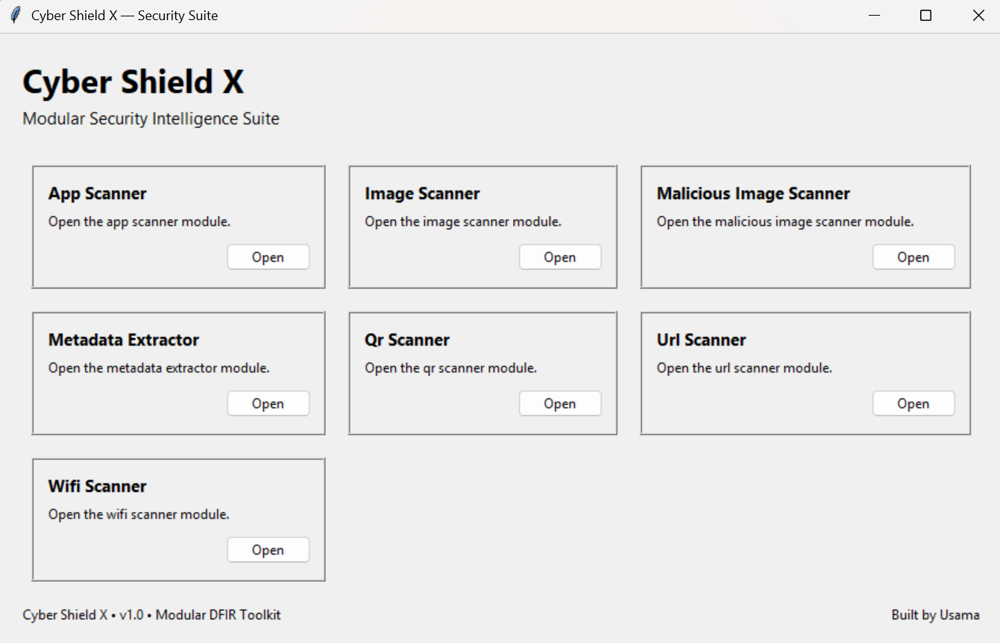
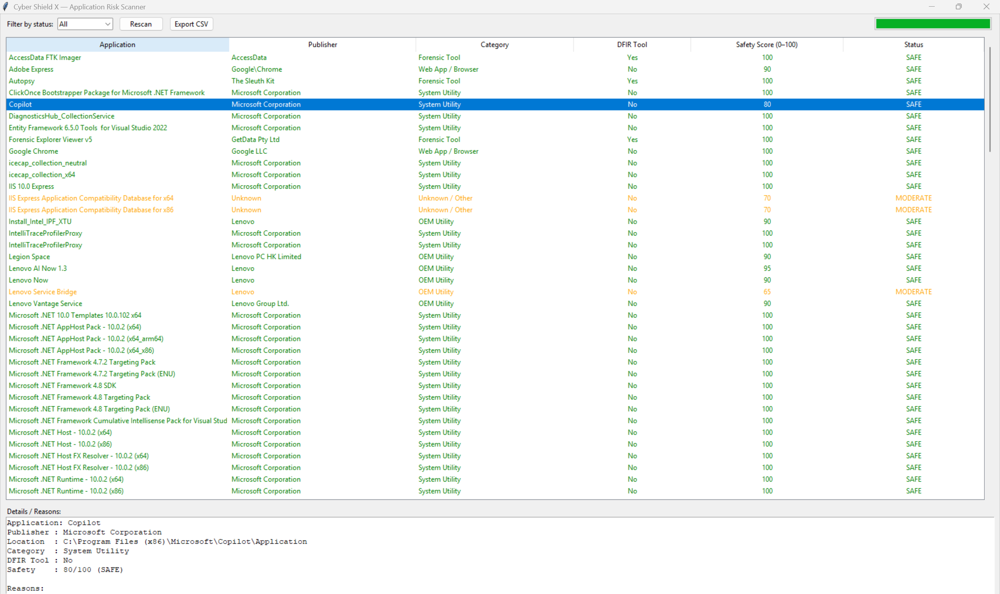
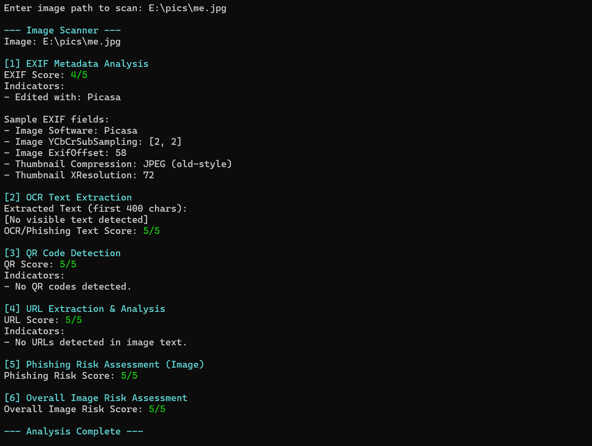
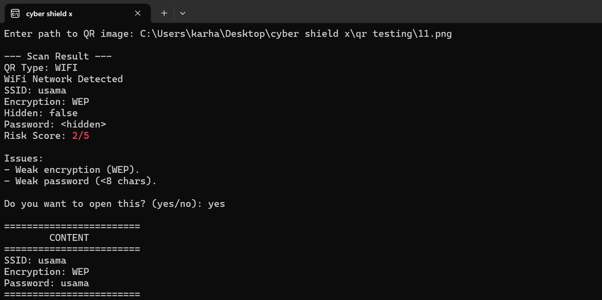
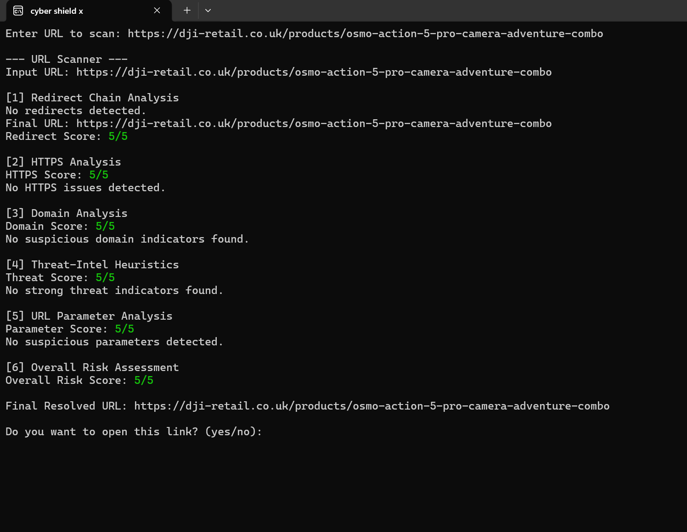
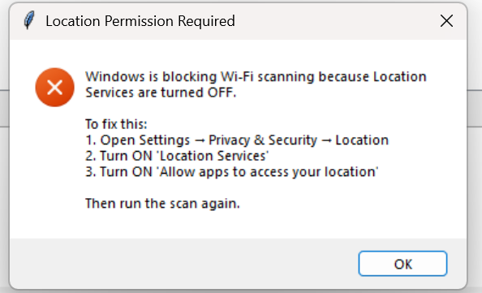
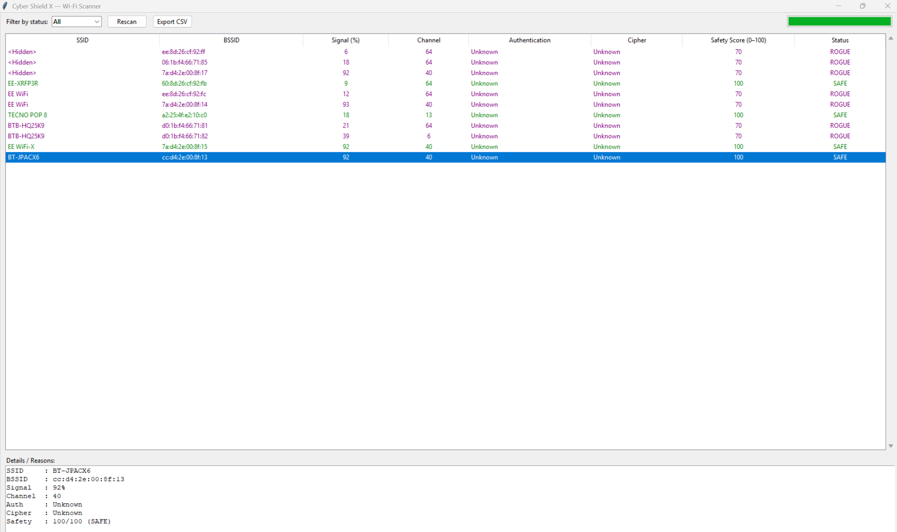

# Cyber Shield X — Modular DFIR Security Toolkit  
Cyber Shield X is a lightweight and modular DFIR security toolkit built to analyse common digital threats in a fast, safe, and structured way. It provides dedicated scanners for Wi‑Fi networks, URLs, QR codes, images, metadata, and installed applications. Each module delivers clear risk scoring, detailed findings, and practical guidance, making the toolkit suitable for students, educators, early‑stage cybersecurity learners, and professionals conducting quick assessments.

## Features
### 1. Wi Fi Scanner
The Wi‑Fi Scanner identifies several types of wireless security risks, including open networks, weak or legacy encryption (WEP/TKIP), duplicate SSIDs, rogue access points that mimic legitimate networks, unusual channel behaviour, and unknown or suspicious authentication/cipher configurations.

### 2. URL Scanner
The URL Scanner analyses the full redirect chain, checks HTTPS configuration, evaluates domain reputation, applies threat‑intelligence heuristics, inspects URL parameters, and identifies the final resolved destination.

### 3. Image Scanner
The Image Scanner performs EXIF metadata extraction, OCR text analysis, hidden URL detection, hidden QR code identification, phishing‑text scoring, and an overall image risk assessment.

### 4. QR Scanner
The QR Scanner processes all QR code formats and identifies URL, Wi‑Fi setup, and payment QR codes. It evaluates the content for potential risks, assigns a safety score, lists detected issues, and provides a safe‑open option to prevent accidental exposure to malicious links.

### 5. App Scanner
The App Scanner provides a detailed overview of installed applications by displaying their publisher, category, DFIR relevance, and assigned safety score. It also classifies each application as SAFE, MODERATE, or DANGEROUS based on its characteristics and potential security impact.

### 6. Metadata Extractor (In Development)
The Metadata Extractor analyses EXIF and file‑level metadata to reveal editing traces, hidden or unusual fields, the software used to create or modify the file, and any embedded thumbnail metadata. This helps identify tampering, manipulation, or hidden information within digital files.

### 7. Malicious Image Scanner (In Development)
The Malicious Image Scanner examines images for signs of manipulation or embedded threats. It identifies suspicious patterns, hidden payloads, and anomalies in the internal structure of the file that may indicate malicious behaviour or tampering.

## System Architecture
Cyber Shield X follows a modular architecture designed for clarity and extensibility. The input layer receives user‑provided data such as URLs, images, QR codes, or Wi‑Fi networks. Each scanner module processes this input independently using its own analysis logic. The scoring engine then evaluates the results and assigns appropriate risk levels. The output layer presents these findings through a clean GUI or terminal interface, ensuring the toolkit remains easy to expand, maintain, and integrate with future modules.

## Tech Stack

- Python 3
- Tkinter / CustomTkinter
- Pillow
- Pyzbar
- Pytesseract
- ExifRead
- Requests
- Regex
- Windows netsh (Wi Fi scanning)

## Threat Model
Cyber Shield X protects against:

- Phishing links
- Rogue Wi‑Fi networks
- Malicious QR codes
- Metadata leaks
- Suspicious applications
- Hidden text inside images
- Weak encryption
- Fake SSIDs (Evil Twin attacks)

## Screenshots

### Dashboard

### App Scanner

### Image Scanner

### QR Scanner

### URL Scanner

### Wi‑Fi Scanner

## Installation

The operational source code for Cyber Shield X is currently private for security and research reasons.  This repository provides documentation, architecture details, module descriptions, and screenshots.

**A public demo or partial code release may be provided in the future.**

## How It Works

Cyber Shield X operates through a modular dashboard where users select the scanner they want to run.  Each module performs its own analysis and displays results through a clean GUI interface.

**This repository documents how each module works, including screenshots and explanations.**

## Risk Scoring Summary

### URL / QR / Image Scanners (0–5)
- **4–5 → SAFE**
- **>3 → MODERATE**
- **<3 → DANGEROUS**

### Wi‑Fi Scanner (0–100)
- **80–100 → SAFE**
- **50–79 → MODERATE**
- **Below 50 → DANGEROUS**
- **rogue_flag = True → ROGUE** (overrides all other scores)

### App Scanner (0–100)
- **80+ → SAFE**
- **60–79 → MODERATE**
- **Below 60 → DANGEROUS**

## Roadmap
- Mobile app (Android / iOS)
- Browser extension
- Virtual machine sandbox for safe analysis
- AI‑based phishing detection
- Cloud threat‑intelligence integration
- Unicode and homoglyph detection
- Zero‑width character detection
- Enhanced metadata extraction
- Advanced malicious image analysis

## Author

**Muhammad Usama Fakhar**  
Cybersecurity & DFIR Enthusiast  
Creator of **Cyber Shield X**  
Developer of the modular security toolkit

Technical review and contribution by:  
**Faraz Ali**  
Ex‑PFSA Digital Forensic Expert  
Forensic Consultant (Government of Sindh & Khyber Pakhtunkhwa)

## License
Cyber Shield X is not licensed yet.  A license will be added when the project is ready for public release.

## Disclaimer
Cyber Shield X is intended for educational and defensive cybersecurity use only.
