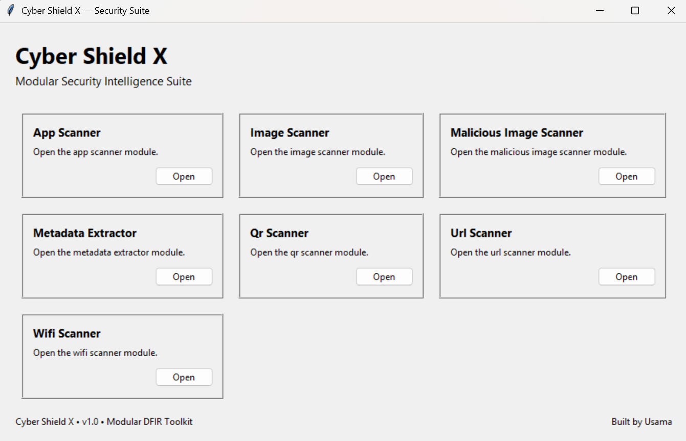
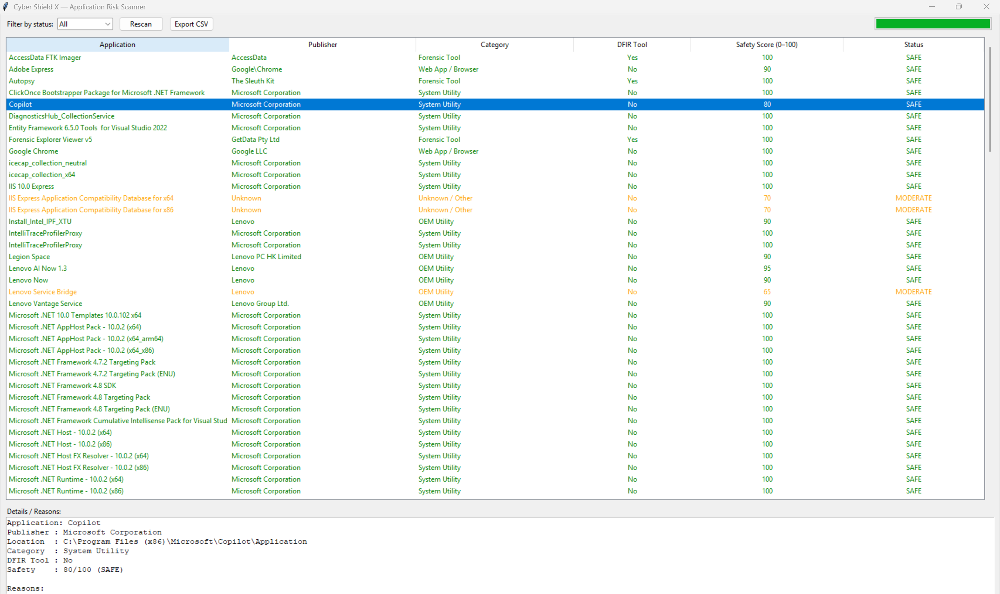
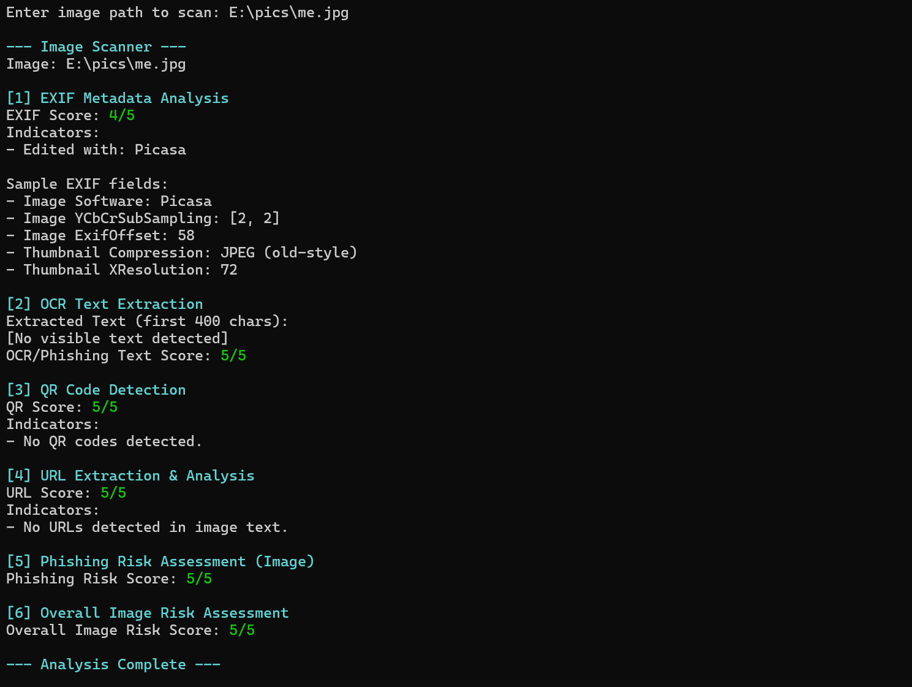
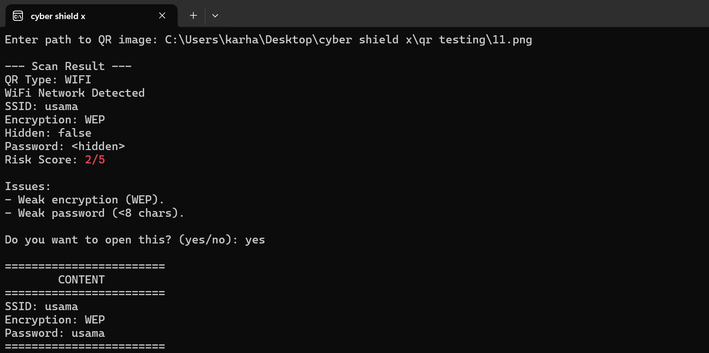
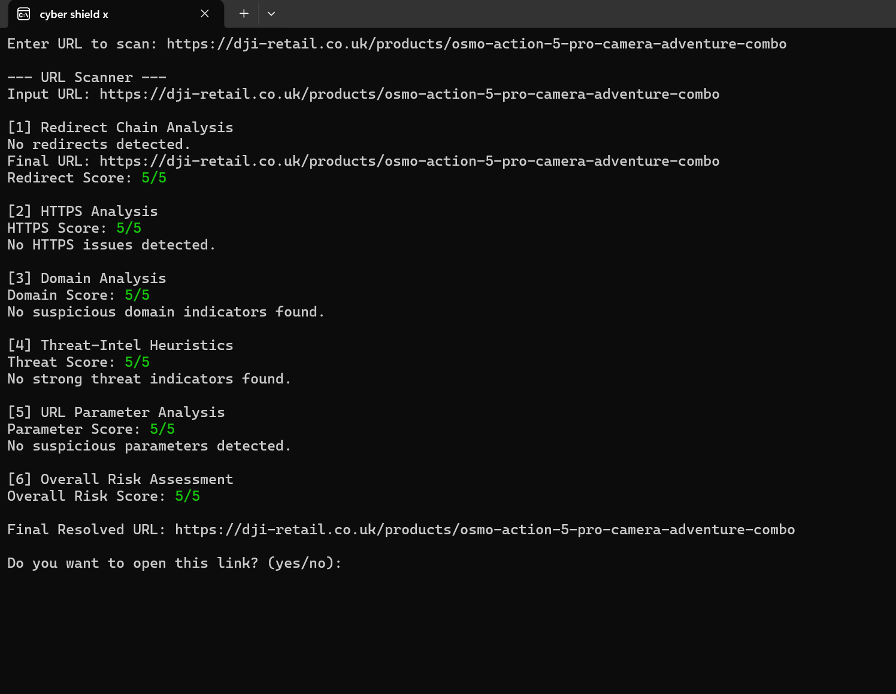
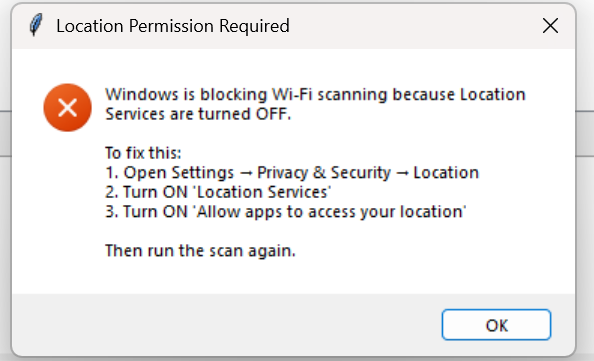
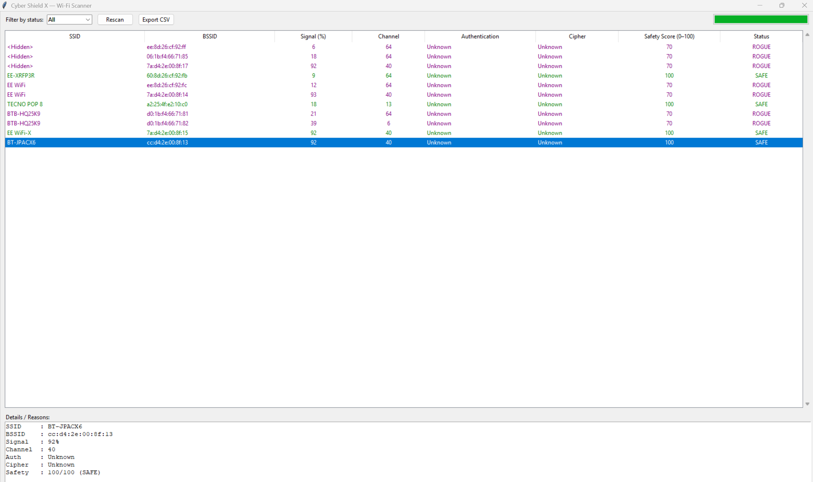
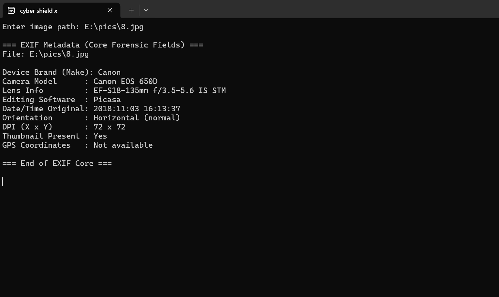
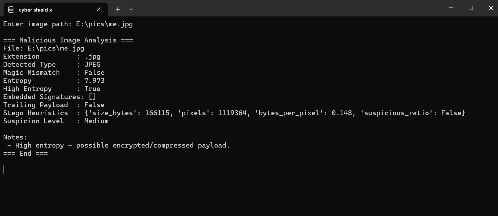

# Cyber Shield X - A lightweight and modular cybersecurity toolkit
Cyber Shield X is a DFIR-inspired, multi-scanner and modular cybersecurity toolkit designed to analyse common digital threats in everyday life in a fast and structured way. The scanners include QR Scanner, Wi-Fi Scanner, Image Scanner, App Scanner, Metadata Extractor, Malicious Image Scanner and URL Scanner. Each module performs its own detailed scanning and provides clear risk scoring, making it efficient and user-friendly for early-stage cybersecurity learners, professionals, students, educators and everyday users.

## Features
### 1. Wi-Fi Scanner
It detects open networks, rogue access points, duplicate SSIDs, BSSIDs, channel behaviour, suspicious authentication and cipher configuration. Based on these factors, it produces a safety score and categorises networks as Safe, Moderate, Dangerous or Rogue.

### 2. URL Scanner
The URL scanner performs the following:

- Domain reputation analysis.

- Checks URLs to analyse redirect chains, HTTPS configuration and hidden or suspicious parameters. It also applies threat intelligence heuristics same as QR scanner.

- Provides a clear risk score and asks from user whether to open it or not.

### 3. Image Scanner
It performs OCR text analysis, hidden URL detection, hidden QR identification and conducts EXIF metadata extraction. After that, it provides phishing risk scoring and overall image risk score.

### 4. QR Scanner

- It scans supported QR code formats and decides their type (URL, Wi-Fi, payment info etc.)

- It applies heuristic checks to analyse suspicious URLs, identifies mismatch QR formats (e.g., QR says Wi-Fi but contains a link), checks unusual patterns like shortened links or redirects, detects encoded or hidden text, marks risky behaviour and provides an overall risk score based on analysis and asks the user whether to open it.

### 5. App Scanner
It displays all the installed applications on the system, their publishers and category. It also checks their DFIR relevance and assigns them a safety score. Based on scoring, it categorises them as Safe, Moderate or Dangerous. Moreover, if a user clicks on any installed app, it also shows details and reasons why an app is classified as moderately safe or dangerous.

### 6. Metadata Extractor (In Development)
It currently extracts EXIF and file-level metadata, checks for editing traces, embedded thumbnails, software usage and hidden fields for suspicious links.

### 7. Malicious Image Scanner (In Development)
It currently analyses hidden payloads, malicious behaviour, anomalies in structure and suspicious patterns in an image.

## Tech Stack

- Python 3.10
- ExifRead
- Regex
- Requests
- Pillow
- Pytesseract
- Tkinter/Custom Tkinter
- Pyzbar
- Windows netsh

## Threat Model
Cyber Shield X is designed to help users identify and assess risks associated with:

- Malicious QR codes
- Phishing links
- Suspicious applications
- Rogue Wi-Fi networks
- Fake SSIDs (Evil Twin Attacks)
- Metadata leaks
- Hidden text inside images
- Weak encryption

## Screenshots

### Dashboard

<p align="center"><i>Main dashboard displaying all scanners.</i></p>

### App Scanner

<p align="center"><i>App scanner Displaying all the installed apps, their category, DFIR relevance and risk scoring.</i></p>

### Image Scanner

<p align="center"><i>Image scanner showing EXIF metadata, OCR extraction, QR/URL detection and overall risk scoring.</i></p>

### QR Scanner

<p align="center"><i>QR scanner showing QR type, showing SSID, encryption type, password strength issue and risk score.</i></p>

### URL Scanner

<p align="center"><i>URL scanner displaying redirect chain, domain analysis, threat-intel heuristics, HTTP checks, URL parameter inspection and overall risk scoring.</i></p>

### Wi‑Fi Scanner


*Image showing Windows blocking Wi-Fi scanning because location is off.*


<p align="center"><i>Wi-Fi scanner displaying network SSID, BSSID, signal strength, channel, authentication, cipher and status based on score.</i></p>

### Metadata Extractor

<p align="center"><i>Metadata extractor showing EXIF details including camera brand, model, lens info, editing software, date and time, presence of thumbnail and GPS coordinates.</i></p>

### Malicious Image Scanner

<p align="center"><i>Malicious image scanner displaying a medium suspicion level due to high entropy, valid magic bytes, file extension type, absence of trailing payload and normal stego heuristics.</i></p>

## Code Snippets
#### QR Scanner - Payment Detection Code

```python
PAYMENT_HINTS = [
    "upi:", "upi://", "paytm", "gpay", "phonepe",
    "paypal", "stripe", "payu", "razorpay",
    "bitcoin:", "ethereum:", "btc:", "eth:", "iban:", "payto:"
]

def is_payment_payload(text):
    lower = text.lower()
    return any(h in lower for h in PAYMENT_HINTS)
```
#### App Scanner - Category Detection Code

```python
def detect_category(app_name, publisher):
    name = app_name.lower()
    pub = (publisher or "").lower()

    # Basic DFIR tool detection
    if is_dfir_tool(app_name, publisher):
        return "Forensic Tool"

    # Keyword-based classification
    for category, keywords in CATEGORY_KEYWORDS.items():
        if any(kw in name or kw in pub for kw in keywords):
            return category

    return "Unknown / Other"
```

## How It Works


Cyber Shield X operates through a modular dashboard where users select the scanner they want to run. Each module performs its own analysis and displays results through a clean GUI interface.


<p align="center"><i>It processes user input through modular scanners, extracts relevant data, performs threat analysis and generates a unified risk score.</i></p>

## Risk Scoring Summary

### URL / QR / Image Scanners (0–5)
- **4–5** → Safe
- **3 to <4** → Moderate
- **<3** → Dangerous

### Wi‑Fi Scanner (0–100)
- **80–100** → Safe
- **50–79** → Moderate
- **Below 50** → Dangerous
- **Rogue flag** = True → Rogue

### App Scanner (0–100)
- **80+** → Safe
- **60–79** → Moderate
- **Below 60** → Dangerous

## Roadmap
- Mobile application (Android and iOS)
- Browser extension
- Gmail scanner: Gmail phishing scanner and header analyser
- Virtual machine sandboxing
- Enhanced and complete image metadata extractor
- Unicode and zero-width character detection
- Advanced malicious image analysis
- Cloud-based threat analysis

## Creator and Technical Review

**Muhammad Usama Fakhar**  
Cybersecurity & DFIR Enthusiast  
Creator of **Cyber Shield X**  
Developer of the modular security toolkit

Technical review by:
**Faraz Ali**  
Former Digital Forensic Expert, Punjab Forensic Science Agency  
Forensic Consultant (Government of Sindh & Khyber Pakhtunkhwa)

## License
Cyber Shield X is not licensed yet. A license will be added when the project is ready for public release.

## Disclaimer
Cyber Shield X is intended for educational and defensive cybersecurity use only. It is not a replacemnet for enterprise-level security solutions.
